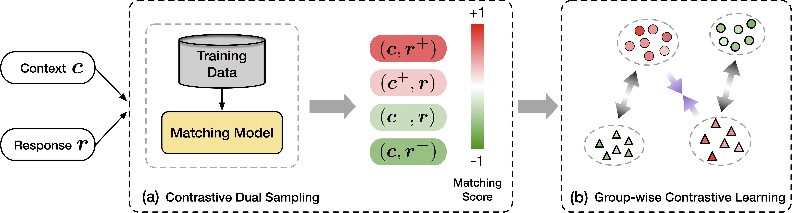

# Group-wise Contrastive Learning for Neural Dialogue Generation

This repo contains preliminary code of the EMNLP2020 paper named "[Group-wise Contrastive Learning for Neural Dialogue Generation](https://arxiv.org/abs/2009.07543)".

This codebase is built upon the [ParlAI](https://parl.ai/) project (Thanks for their pioneering contributions on developing such a great conversational platform!). 
Check `parlai/agents/contrastive_learning` for framework implementations.
Running scripts can be found in `projects/contrastive_learning`.

## Framework Overview



## Requirements
- Python3
- Pytorch 1.2 or newer

Dependencies of the core modules are listed in requirement.txt.

## Installing
```
git clone git@github.com:hengyicai/ContrastiveLearning4Dialogue.git ~/ContrastiveLearning4Dialogue
cd ~/ContrastiveLearning4Dialogue; python setup.py develop
echo "export PARLAI_HOME=~/ContrastiveLearning4Dialogue" >> ~/.bashrc; source ~/.bashrc
```

## Dataset
Download [PersonaChat](https://drive.google.com/file/d/1E2Rp5G9Mrljbih7P9dMO9-EKxhulJVYd/view?usp=sharing)/[OpenSubtitles](https://drive.google.com/file/d/1FTlPZ31c5qdSOa0S4sqkW44Ohg0SuumY/view?usp=sharing)/[Douban](https://drive.google.com/file/d/1jjv64eA7Hvv_3J54JOuYdEyDz1Pc3jIo/view?usp=sharing) and untar them to `${PARLAI_HOME}/data/` as:
```bash
data
├── DoubanConversaionCorpus
│   ├── douban.embed.vec
│   ├── test.txt
│   ├── train.txt
│   ├── train.txt.lengths
│   └── valid.txt
├── OpenSubExtend
│   ├── opensub_extend.embed.vec
│   ├── test.txt
│   ├── train.txt
│   ├── train.txt.lengths
│   └── valid.txt
└── PersonaChatExtend
    ├── personachat_extend.embed.vec
    ├── test.txt
    ├── train.txt
    ├── train.txt.lengths
    └── valid.txt
```

## Running

```
cd ~/ContrastiveLearning4Dialogue
bash projects/contrastive_learning/shell/run.sh
```

The last line of `projects/contrastive_learning/shell/run.sh` specifies preliminary arguments for the training:
```

# MODEL_NAME TO_MINIMIZE TASK PRETRAIN_STEPS SAMPLE_K CONTRAST_BY NAIVE_NEG_SAMPLING CL_THRESHOLD CL_ANNEAL ANNEAL_SPEED
export CUDA_VISIBLE_DEVICES=0; train_model cl_seq2seq to_minimize personachat_extend 5000 6 both False 0.5 True 1.0
```

See `projects/adaptive_learning/shell/run.sh` for details.

### Running Details

#### 1. Preparing the reference model

Since the contrastive learning framework involves an auxiliary model during the training process, i.e., the reference model $p_n(\cdot; \phi)$, we need to prepare a reference model before running the contrastive learning procedure. We can use the same script to train a reference model, for example, a naive seq2seq model:

```bash
# MODEL_NAME TO_MINIMIZE TASK PRETRAIN_STEPS SAMPLE_K CONTRAST_BY NAIVE_NEG_SAMPLING CL_THRESHOLD CL_ANNEAL ANNEAL_SPEED
export CUDA_VISIBLE_DEVICES=0; train_model seq2seq ppl personachat_extend 5000 6 both False 0.5 True 1.0
```

#### 2. Specifying mandatory arguments

There are several arguments required to be declared explicitly in `projects/contrastive_learning/shell/run.sh`. 

Input the reference model path here:
```bash
declare -A ref_model_files=(
  ["none"]=None
  ["REF_MODEL_KEY"]="PATH/TO/THE/REFERENCE/MODEL"
)
```
and use it by setting the variable `ref_model`:
```bash
ref_model=REF_MODEL_KEY
```

#### 3. Running the framework

Apply the contrastive learning frmaework to seq2seq (or transformer by replacing `cl_seq2seq` with `cl_transformer`):
```bash
# MODEL_NAME TO_MINIMIZE TASK PRETRAIN_STEPS SAMPLE_K CONTRAST_BY NAIVE_NEG_SAMPLING CL_THRESHOLD CL_ANNEAL ANNEAL_SPEED
export CUDA_VISIBLE_DEVICES=0; train_model cl_seq2seq to_minimize personachat_extend 5000 6 both False 0.5 True 1.0
```

Start training by `bash projects/contrastive_learning/shell/run.sh`

## Contact
Please reach me via my email (caihengyi at ict dot ac dot cn) if there is anything unclear.
